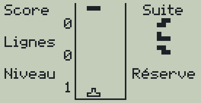
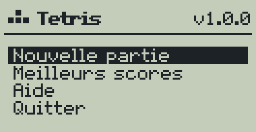
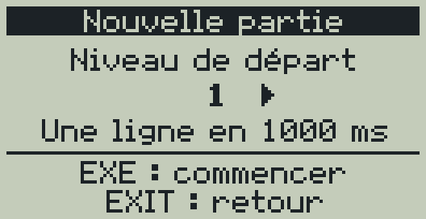
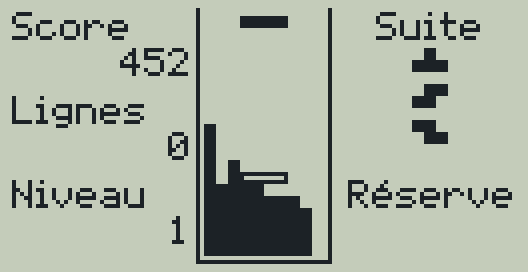
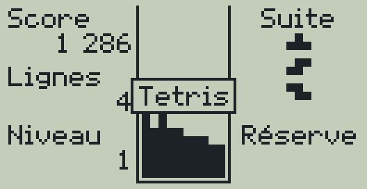
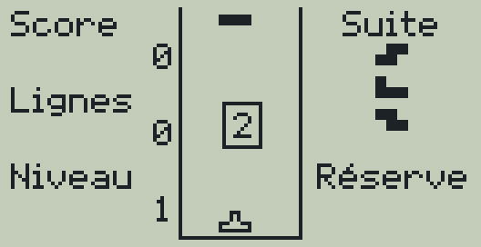
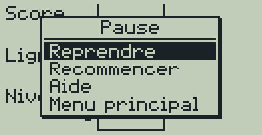
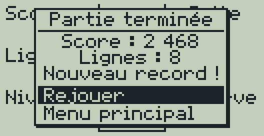
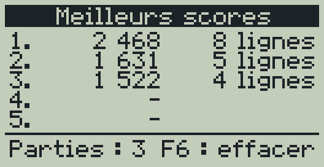
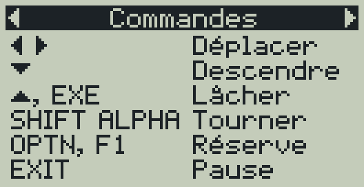

# Tetris pour Casio fx-9750GIII

[](https://github.com/boloru78/tetris-for-casio-fx-9750Giii/actions/workflows/build.yml)
[](LICENSE)


Un jeu de blocs qui tombent pour la calculatrice graphique **Casio
fx-9750GIII**, écrit en C avec
[gint](https://git.planet-casio.com/Lephenixnoir/gint) et le
[fxSDK](https://git.planet-casio.com/Lephenixnoir/fxsdk). Il s'installe comme
une application (add-in `.g1a`) dans le menu principal de la calculatrice :
fluide (60 images par seconde), fidèle aux règles des versions récentes, avec
meilleurs scores et reprise des parties.

<p align="center">
  
</p>

> Tetris est une marque de The Tetris Company. Ce projet est un jeu amateur,
> non officiel et gratuit, sans lien avec elle.

## Sommaire

- [Fonctionnalités](#fonctionnalités)
- [Captures d'écran](#captures-décran)
- [Installation](#installation)
- [Comment jouer](#comment-jouer)
- [Sauvegarde](#sauvegarde)
- [Compiler le jeu soi-même](#compiler-le-jeu-soi-même)
- [Organisation du code](#organisation-du-code)
- [Outils de développement](#outils-de-développement)
- [Publier une nouvelle version](#publier-une-nouvelle-version)
- [Questions fréquentes](#questions-fréquentes)
- [Idées pour la suite](#idées-pour-la-suite)
- [Contribuer](#contribuer)
- [Crédits et licence](#crédits-et-licence)

## Fonctionnalités

- **Plateau classique de 10 × 20 cases** qui tient sur l'écran de 128×64
  pixels sans défilement, avec des cases de 3×3 pixels.
- **Règles des versions récentes** :
  - rotation **SRS**, avec les décalages qui permettent de tourner contre un
    mur ou de glisser une pièce dans un trou ;
  - pièces tirées **par sacs de 7** : jamais plus de 12 pièces sans barre ;
  - **pièce fantôme** qui montre où la pièce va tomber ;
  - **réserve** pour garder une pièce de côté, une fois par pièce ;
  - **3 pièces suivantes** affichées ;
  - **chute immédiate** et **chute douce** ;
  - un **court délai au sol** avant que la pièce se fige, pour la glisser au
    dernier moment.
- **15 niveaux** de vitesse : on monte d'un niveau toutes les 10 lignes, et on
  peut commencer à n'importe quel niveau.
- **Les 5 meilleurs scores**, avec les lignes et le niveau atteint, et le
  nombre de parties jouées.
- **Pause** (le plateau est caché pour ne pas réfléchir gratuitement) avec
  compte à rebours à la reprise, et **reprise de partie** : après la touche
  MENU, après une extinction, ou au lancement suivant.
- **Aide intégrée** : règles, commandes, rotation, réserve, points, niveaux.
- **Déplacements fluides** : une flèche maintenue répète le déplacement, comme
  sur une console.
- Interface **entièrement en français**, avec une police dessinée pour le jeu
  qui affiche les accents.

## Captures d'écran

| Menu principal | Niveau de départ | Partie en cours |
| :---: | :---: | :---: |
|  |  |  |
| **Tetris !** | **Compte à rebours** | **Pause** |
|  |  |  |
| **Fin de partie** | **Meilleurs scores** | **Aide** |
|  |  |  |

Ces images sont produites automatiquement par le
[simulateur PC](sim/README.md) à partir du vrai code du jeu
(`make screenshots`). Les parties y sont jouées par un petit joueur
automatique ([`tools/bot.c`](tools/bot.c)).

## Installation

### 1. Télécharger le jeu

Téléchargez le fichier **`Tetris.g1a`** de la dernière version dans la page
[Releases](https://github.com/boloru78/tetris-for-casio-fx-9750Giii/releases).

Le fichier est aussi produit à chaque modification du code : onglet
[Actions](https://github.com/boloru78/tetris-for-casio-fx-9750Giii/actions),
dernière exécution réussie, artefact `Tetris-g1a` (archive ZIP à
décompresser).

### 2. Copier le fichier sur la calculatrice

La fx-9750GIII se comporte comme une clé USB : aucun logiciel n'est
nécessaire, sur macOS comme sur Windows ou Linux.

1. Reliez la calculatrice à l'ordinateur avec son câble USB.
2. Sur l'écran de la calculatrice, choisissez la connexion **USB Flash**
   (touche <kbd>F1</kbd>).
3. Un nouveau disque apparaît sur l'ordinateur (dans le Finder sur macOS).
   Copiez `Tetris.g1a` **à la racine** de ce disque, pas dans un dossier.
4. **Éjectez** le disque avant de débrancher le câble. La calculatrice termine
   alors l'enregistrement du fichier ; attendez qu'elle revienne au menu.

**Sur macOS**, le Finder ajoute des fichiers cachés (`._Tetris.g1a`,
`.fseventsd`…) qui prennent de la place sur la calculatrice. Pour l'éviter,
copiez le jeu depuis le Terminal (remplacez `CALCULATRICE` par le nom du
disque, affiché par `ls /Volumes`) :

```sh
cp -X ~/Downloads/Tetris.g1a /Volumes/CALCULATRICE/   # copie sans fichier caché
dot_clean -m /Volumes/CALCULATRICE                    # supprime les ._ déjà créés
```

### Place nécessaire

Le jeu occupe environ **40 Ko**, et sa sauvegarde `TETRIS.sav` moins de
400 octets. Les deux vont dans la **mémoire de stockage** (3 Mo), pas dans la
mémoire principale où vivent les programmes Basic.

### 3. Lancer le jeu

Appuyez sur <kbd>MENU</kbd> : une nouvelle icône **TETRIS** apparaît dans le
menu principal (souvent tout en bas, utilisez les flèches). Sélectionnez-la
et appuyez sur <kbd>EXE</kbd>.

### Désinstaller

Supprimez `Tetris.g1a` (le jeu) et `TETRIS.sav` (scores et partie en cours),
soit depuis l'ordinateur en mode USB Flash, soit depuis l'application
**MEMORY** de la calculatrice (mémoire de stockage).

## Comment jouer

### But du jeu

Des pièces de quatre cases tombent dans le puits. Déplacez-les et
tournez-les pour remplir des lignes entières : une ligne complète disparaît
et rapporte des points. La partie s'arrête quand les pièces débordent en haut
du puits. Effacer quatre lignes d'un coup, avec une barre, s'appelle un
**Tetris** et rapporte le plus de points.

### Commandes

La calculatrice se tient comme une manette : la main gauche tourne et met en
réserve, la main droite déplace.

| Touche | Pendant la partie | Dans les menus |
| --- | --- | --- |
| ◀ ▶ | Déplacer la pièce (maintenir pour répéter) | Changer de niveau ou de page |
| ▼ | Descendre plus vite (maintenir) | Choix suivant |
| ▲ ou <kbd>EXE</kbd> | Lâcher la pièce tout en bas | Choix précédent / Valider |
| <kbd>SHIFT</kbd> | Tourner vers la droite | Valider |
| <kbd>ALPHA</kbd> | Tourner vers la gauche | – |
| <kbd>OPTN</kbd> ou <kbd>F1</kbd> | Mettre la pièce en réserve | – |
| <kbd>EXIT</kbd> | Pause (reprendre, recommencer, aide, menu) | Retour |
| <kbd>F6</kbd> | – | Effacer les scores (écran Meilleurs scores) |
| <kbd>MENU</kbd> | Menu de la calculatrice (la partie est sauvegardée) | Idem |
| <kbd>SHIFT</kbd> puis <kbd>AC/ON</kbd> | Éteindre la calculatrice (la partie reprend en pause) | Idem |

### L'écran de jeu

- **À gauche** : score, lignes effacées et niveau.
- **Au centre** : le puits. La pièce qui tombe est accompagnée de sa **pièce
  fantôme**, dessinée en contour, à l'endroit où elle tomberait.
- **À droite** : les 3 pièces suivantes, puis la réserve. Une fois utilisée,
  la réserve s'affiche en pointillés jusqu'à la pièce suivante.

### Points

| Action | Points |
| --- | --- |
| 1 ligne | 100 × niveau |
| 2 lignes | 300 × niveau |
| 3 lignes | 500 × niveau |
| 4 lignes (Tetris) | 800 × niveau |
| Chute douce (▼) | 1 par ligne descendue |
| Chute immédiate (▲) | 2 par ligne descendue |

### Niveaux

La vitesse augmente toutes les 10 lignes, jusqu'au niveau 15, selon la
formule des versions récentes : au niveau 1, la pièce descend d'une ligne par
seconde ; au niveau 10, toutes les 64 ms ; au niveau 15, de plusieurs lignes
par image. En commençant à un niveau plus élevé, on y reste jusqu'à avoir
effacé assez de lignes pour le dépasser (50 lignes pour le niveau 5).

### Abandonner une partie

Recommencer ou lancer une nouvelle partie alors qu'une autre est en cours
demande une confirmation. La partie abandonnée s'arrête et son score compte
pour le classement.

## Sauvegarde

Le jeu écrit le fichier **`TETRIS.sav`** à la racine de la mémoire de
stockage de la calculatrice. Il contient les meilleurs scores, le nombre de
parties, le dernier niveau de départ choisi et la partie en cours, s'il y en
a une. Il est mis à jour :

- à la fin de chaque partie ;
- quand on quitte une partie par le menu de pause ;
- juste avant de passer au menu de la calculatrice (touche MENU) ou de
  s'éteindre ;
- en quittant le jeu.

Le format du fichier est décrit en tête de [`src/save.c`](src/save.c). Une
somme de contrôle protège contre les fichiers abîmés, et chaque partie
relue est vérifiée (pièce à sa place, lignes cohérentes…) : un fichier
illisible est simplement ignoré.

## Compiler le jeu soi-même

Ce n'est pas nécessaire pour jouer : la CI produit le fichier `.g1a`. Il faut
le fxSDK, qui comprend le compilateur croisé `sh-elf-gcc` (les calculatrices
utilisent un processeur SuperH), la bibliothèque C fxlibc et le noyau gint.

### Méthode 1 : Docker (la plus simple sur macOS)

Avec [Docker Desktop](https://www.docker.com/products/docker-desktop/)
installé, une seule commande suffit, à lancer dans le dossier du projet.
L'image est celle qu'utilise la CI ; elle fonctionne sur les Mac Intel comme
sur les Mac Apple Silicon.

```sh
docker run --rm -v "$PWD":/src -w /src manawyrm/fxsdk:0.0.3 \
    bash -c 'PATH=/root/.local/bin:$PATH fxsdk build-fx'
```

Le fichier `Tetris.g1a` apparaît dans le dossier du projet.

### Méthode 2 : installation native avec GiteaPC

[GiteaPC](https://git.planet-casio.com/Lephenixnoir/GiteaPC) installe tout le
fxSDK depuis la forge de Planète Casio (compter environ 30 minutes). Les
étapes détaillées pour macOS sont dans le README du projet frère
[Minesweeper](https://github.com/boloru78/minesweeper-for-casio-fx-9750Giii#méthode-2--installation-native-avec-giteapc).
Ensuite, dans le dossier du projet :

```sh
fxsdk build-fx      # produit Tetris.g1a
```

## Organisation du code

```
.
├── src/                 Code du jeu (C11)
│   ├── main.c             point d'entrée sur la calculatrice
│   ├── platform.h         interface entre le jeu et la machine
│   ├── platform_gint.c    implémentation calculatrice (seul fichier gint)
│   ├── app.c              enchaînement des écrans
│   ├── screens.c          menu principal, niveau de départ, meilleurs scores
│   ├── play.c             boucle en temps réel, pause, fin de partie
│   ├── help.c             pages d'aide
│   ├── tetris.c           règles : chute, rotation, lignes, score, réserve
│   ├── piece.c            formes des pièces et tables de rotation SRS
│   ├── scores.c           meilleurs scores
│   ├── save.c             format du fichier TETRIS.sav
│   ├── rng.c              générateur aléatoire (xorshift32)
│   ├── render.c           dessin du puits, du score et des pièces suivantes
│   ├── ui.c               barre de titre, listes, boîtes de dialogue
│   ├── gfx.c              dessin dans l'image 128×64, texte UTF-8
│   └── assets.c           police et images (généré, ne pas modifier)
├── assets/              Police, logo et icône dessinés en texte
├── assets-fx/icon.png   Icône de l'add-in (générée depuis assets/icon.txt)
├── sim/                 Simulateur PC et ses scripts (voir sim/README.md)
├── tests/               Tests de la logique, lancés sur PC
├── tools/               gen_assets.py (ressources), pbm_to_png.py (captures),
│                        bot.c (joueur automatique des captures)
├── docs/images/         Captures d'écran du README (générées)
├── .github/             CI (compilation, tests, releases) et modèles d'issues
├── CMakeLists.txt       Compilation de l'add-in avec le fxSDK
└── Makefile             Outils de développement sur PC
```

### Principes

- **Le jeu ne dépend pas de gint.** Tout le code de `src/` est du C portable ;
  seuls `main.c` et `platform_gint.c` utilisent gint, derrière la petite
  interface de [`platform.h`](src/platform.h) (affichage, clavier, temps,
  fichier). Le simulateur PC fournit une autre implémentation de cette
  interface, ce qui permet de tester et de capturer le vrai jeu sur
  ordinateur.
- **Une partie avance d'une image à la fois.** `tetris_step()` reçoit l'état
  des boutons et fait avancer la partie de 1/60 s. Tout est compté en images
  (gravité, délai au sol, répétition des flèches) : une partie est donc
  parfaitement reproductible à partir de sa graine et des touches appuyées,
  ce qui rend les tests et les captures fiables.
- **Logique séparée de l'affichage.** `tetris.c`, `piece.c`, `scores.c` et
  `save.c` ne dessinent rien et ne lisent pas le clavier : ils sont couverts
  par les tests automatiques.
- **Dessin logiciel.** Le jeu dessine dans une image en mémoire qui a
  exactement le format de la mémoire vidéo de gint (128×64 pixels, 1 bit par
  pixel), puis la copie à l'écran. Le processeur dort entre deux images.
- **Ressources en texte.** La police (avec accents), le logo et l'icône sont
  dessinés avec des `#` et des `.` dans [`assets/`](assets/), puis convertis
  en C par `tools/gen_assets.py`. Pour modifier une image : éditer le fichier
  texte, lancer `make assets`.

Ce projet reprend la base du
[démineur du même auteur](https://github.com/boloru78/minesweeper-for-casio-fx-9750Giii) :
police, boîtes de dialogue, simulateur et outils.

## Outils de développement

Les outils PC fonctionnent sur macOS et Linux avec le compilateur C du
système et Python 3 avec Pillow (`pip install pillow`, ou
`sudo apt install python3-pil` sur Debian ou Ubuntu).

| Commande | Rôle |
| --- | --- |
| `make test` | tests de la logique (rotations, sac de 7, gravité, lignes, score, réserve, délai au sol, sauvegarde, texte) |
| `make sim` | compile le simulateur PC `build/tetris-sim` |
| `make check-texts` | rejoue les scripts du simulateur et échoue si un texte dépasse de l'écran |
| `make screenshots` | régénère les captures et l'animation de `docs/images/` |
| `make build/bot` | compile le joueur automatique qui écrit les touches des captures |
| `make assets` | régénère `src/assets.c` et `assets-fx/icon.png` après une modification de `assets/` |
| `make check` | tout vérifier, comme la CI |
| `make fx` | compile l'add-in (raccourci pour `fxsdk build-fx`) |

Les tests et le simulateur sont compilés avec AddressSanitizer et
UndefinedBehaviorSanitizer pour détecter les erreurs mémoire ; `make
SANITIZE=` les désactive.

### Intégration continue

À chaque modification, [GitHub Actions](.github/workflows/build.yml) :

1. lance `make check` sur Linux ;
2. compile l'add-in avec le fxSDK (image Docker
   [`manawyrm/fxsdk`](https://github.com/Manawyrm/fxsdk-docker), épinglée par
   son empreinte) et publie `Tetris.g1a` comme artefact ;
3. pour un tag `v*`, crée une release GitHub avec le fichier `.g1a`.

## Publier une nouvelle version

1. Mettre à jour le numéro de version dans [`src/app.h`](src/app.h)
   (`APP_VERSION`) et dans [`CMakeLists.txt`](CMakeLists.txt) (`project()` et
   `VERSION` de `generate_g1a`, au format `MM.mm.pppp`).
2. Vérifier : `make check`, puis tester sur la calculatrice.
3. Créer et pousser le tag :

   ```sh
   git tag v1.1.0
   git push origin v1.1.0
   ```

   La CI crée la release et y joint `Tetris.g1a`.

## Questions fréquentes

**Le jeu prend-il beaucoup de place ?** Environ 40 Ko sur les 3 Mo de la
mémoire de stockage. Voir [Place nécessaire](#place-nécessaire).

**L'icône n'apparaît pas dans le menu.** Vérifiez que `Tetris.g1a` est à la
racine de la mémoire de stockage (pas dans un dossier) et que le disque a
bien été éjecté avant de débrancher le câble.

**Les déplacements sont trop rapides (ou trop lents).** Le délai avant la
répétition (200 ms) et son intervalle (50 ms) se règlent dans
[`src/tetris.h`](src/tetris.h) (`DAS_FRAMES` et `ARR_FRAMES`, en images de
1/60 s). N'hésitez pas à ouvrir une issue pour proposer d'autres valeurs.

**Pourquoi ▲ lâche la pièce au lieu de la tourner ?** C'est la convention des
versions récentes, et la touche est sous le pouce droit. La rotation est sur
<kbd>SHIFT</kbd> et <kbd>ALPHA</kbd>, sous le pouce gauche, pour pouvoir
tourner et déplacer en même temps.

**Le jeu fonctionne-t-il sur d'autres calculatrices ?** Il est conçu pour la
fx-9750GIII. La fx-9860GIII et la Graph 35+E II utilisent le même matériel et
devraient le faire fonctionner, sans garantie. Les anciens modèles et les
calculatrices couleur (fx-CG) ne sont pas pris en charge.

**Et en mode examen ?** Comme tous les add-ins, le jeu n'est pas accessible
en mode examen.

**Comment remettre les scores à zéro ?** Écran Meilleurs scores, touche
<kbd>F6</kbd>. Supprimer `TETRIS.sav` efface aussi la partie en cours.

## Idées pour la suite

- Modes de jeu : **Sprint** (40 lignes le plus vite possible) et **Ultra**
  (le meilleur score en 3 minutes).
- Bonus des versions récentes : T-spins, combos, enchaînements de Tetris.
- Réglage de la répétition des déplacements depuis le jeu.
- Plateau tourné d'un quart de tour, avec des cases plus grandes, pour jouer
  la calculatrice couchée.
- Niveaux de gris avec le moteur de gris de gint, pour distinguer les pièces.

## Contribuer

Les signalements de bugs et les idées sont les bienvenus dans les
[issues](https://github.com/boloru78/tetris-for-casio-fx-9750Giii/issues)
(des formulaires guident la rédaction). Pour proposer une modification du
code :

1. créez une branche à partir de `main` ;
2. gardez le style du code existant (C11, indentation de 4 espaces,
   commentaires en français) ;
3. lancez `make check` et, si possible, testez sur une calculatrice ;
4. pour un changement visuel, régénérez les captures avec `make screenshots` ;
5. ouvrez une pull request en décrivant le changement.

## Crédits et licence

- Jeu écrit par **boloru78**, distribué sous [licence MIT](LICENSE).
- [gint](https://git.planet-casio.com/Lephenixnoir/gint) et le
  [fxSDK](https://git.planet-casio.com/Lephenixnoir/fxsdk) sont développés par
  Lephenixnoir et la communauté [Planète Casio](https://www.planet-casio.com/).
- Image Docker du fxSDK utilisée par la CI :
  [Manawyrm/fxsdk-docker](https://github.com/Manawyrm/fxsdk-docker).
- Tables de rotation SRS d'après le
  [Tetris Wiki](https://tetris.wiki/Super_Rotation_System).
- Tetris est une marque de The Tetris Company ; ce projet n'a aucun lien avec
  elle.
